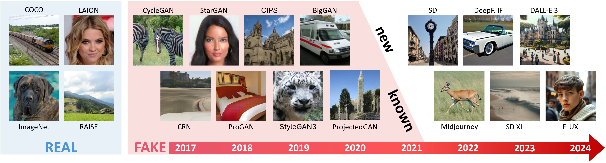

# AI-GenBench: A New Ongoing Benchmark for AI-Generated Image Detection

This is the official repository of the AI-GenBench benchmark, a new benchmark for the detection of AI-generated images, and its related paper:\
[**AI-GenBench: A New Ongoing Benchmark for AI-Generated Image Detection**](https://arxiv.org/abs/2504.20865)\
*Lorenzo Pellegrini, Davide Cozzolino, Serafino Pandolfini, Davide Maltoni, Matteo Ferrara, Luisa Verdoliva, Marco Prati, Marco Ramilli*\
[Verimedia](https://verimediaijcnn2025.github.io/workshop.website/index.html) @ [IJCNN 2025](https://2025.ijcnn.org/)



Unlike existing solutions that evaluate models on static datasets, AI-GenBench introduces a **temporal evaluation framework** where detection methods are incrementally trained on synthetic images, historically ordered by their generative models, to **test their ability to generalize to new generative models**, such as the transition from GANs to diffusion models.

The goal of AI-GenBench is to provide:
- a **benchmark protocol** used to evaluate the ability of detection models to detect images generated using both past and future generation techniques.
- the related **training and evaluation datasets** encompassing a wide variety of image generators released in the last 7 years (2017-2024), from **older GANs** to the most recent **diffusion approaches**.
- a framework to **train and evaluate** detection models on the benchmark, which is based on [PyTorch Lightning](https://lightning.ai/docs/pytorch/stable/).

AI-GenBench is an **on-going benchmark**, which means that we will receive submissions and update the leaderboard over time. Please check the [leaderboard](#leaderboard) section for more information.

In the future, we will also release **new versions** of the benchmark with the goal to cover the latest datasets, conditioning methods, generation techniques, and so on.

## Content
This repository contains the code for:
- Creating the AI-GenBench dataset, a **union of many existing datasets** of both AI-generated and real images
  - For a the complete list of included dataset, see [our paper](https://arxiv.org/abs/2504.20865) and the list found in the [dataset_creation](dataset_creation/README.md) folder.
- Training and evaluating detection models on the AI-GenBench benchmark, using our [Lightning](https://lightning.ai/docs/pytorch/stable/)-based framework you can find in the [training_and_evaluation](training_and_evaluation/README.md) folder.

## Getting started
  - [How to: build the dataset](dataset_creation/README.md)
  - [How to: train and evaluate detectors](training_and_evaluation/README.md)

## Paper and citation
Our paper, **AI-GenBench: A New Ongoing Benchmark for AI-Generated Image Detection**, is available in:
- IJCNN 2025 proceedings, Verimedia workshop (to be published)
- [arXiv](https://arxiv.org/abs/2504.20865)


If you use this benchmark and/or code in your research, please cite our paper:
```bibtex
@ARTICLE{pellegrini2025aigenbench,
  author={Lorenzo Pellegrini and Davide Cozzolino and Serafino Pandolfini and Davide Maltoni and Matteo Ferrara and Luisa Verdoliva and Marco Prati and Marco Ramilli},
  date = {2025},
  journaltitle = {arXiv preprint arXiv:2504.20865},
  title={{AI-GenBench: A New Ongoing Benchmark for AI-Generated Image Detection}}, 
}
```

### Leaderboard
In this leaderboard we will include the evaluation results on the AI-GenBench benchmark. To submit a candidate algorithm for evaluation **please contact us**! The only requirement is that both:
- the method codebase
- a report or paper describing the method
must be publicly available.

Please note that you may freely use the dataset to train and evaluate your model without following the sliding-windows benchmark protocol. However, **we will only include in the leaderboard the methods that followed the protocol**.

We here report the **average-over-time Area Under the ROC Curve (AUC)** of the methods that have been evaluated on the benchmark so far. These results refer to the **Next Period** (that is, the performance on the generators in the next sliding window).

With an `*` we mark the baseline methods originally reported in [our paper](https://arxiv.org/abs/2504.20865).

| Method                | AUC   |
|-----------------------|-------|
| *ViT-L/14 DINOv2      | 94.24 |
| *ViT-L/14 CLIP         | 92.04 |
| *ResNet-50 CLIP       | 81.77 |


## License

### Code license
This code is released under the [BSD-3-Clause license](LICENSE).

### Dataset license
The images are obtained from multiple sources. Please check the [dataset_creation/README.md](dataset_creation/README.md) file for more information on the sources. You'll find the list of the datasets websites / repositories and, from there, you will be able to find the license terms for each dataset.

## Credits
We would like to thank [**identifAI**](https://identifai.net) for their valuable contribution to this project.
