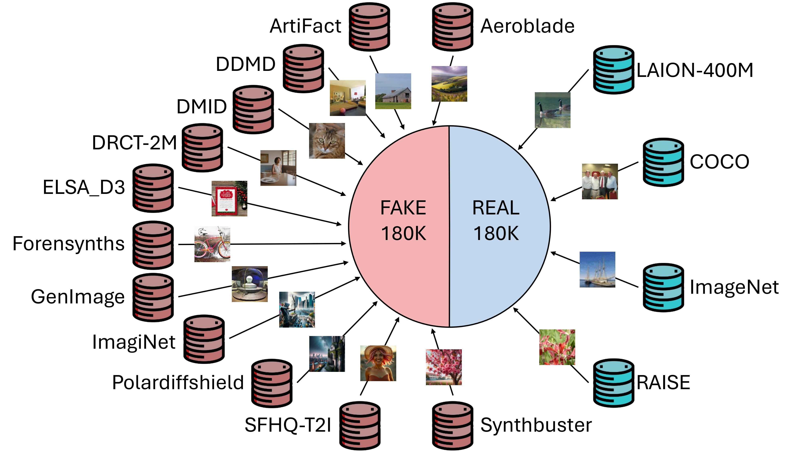

# The AI-GenBench dataset
This folder contains the code to create the AI-GenBench dataset, a large-scale dataset of synthetic images generated by various generative models. The dataset is designed to be used for training and evaluating deepfake detection models.

The benchmark is not readily available for download and requires some manual work to create.

The dataset is a **union of many existing datasets** of both AI-generated and real images. To build it, you will need to follow the steps detailed in [Simple dataset creation steps](#simple-dataset-creation-steps).

A long version of the procedure is available in [`LONG_PROCEDURE.md`](LONG_PROCEDURE.md). The long version also covers the creation of the fake part. However, we recommend the simpler procedure.



## Important
- Beware that **getting things right on the first attempt is not easy**, so please open a discussion or an issue if you need help! 

## Getting started
0. Check and understand license terms for the fake and real repositories. The list of fake repositories is reported in [Synthetic images](#synthetic-images) and the list of real repositories is reported in [Real images](#real-images).
    - For a more precise breakdown of the origin of the images used in the dataset, please refer to the [`resources/DATASET_STATS.md`](resources/DATASET_STATS.md) file. You may also check the filelists in the [`resources`](resources) folder, which contain the exact list of images used in the dataset.
    - The fake part of the dataset is already created and uploaded to HuggingFace Hub, so you can skip the creation of the fake part if you want to use the simple procedure.
1. Clone this repository.
2. Install the required dependencies. You can either install the reduced dataset-build only dependencies or the training and evaluation dependencies as well.
    ```bash
    pip install -r requirements_dataset_creation.txt
    ```
    or:
    ```bash
    pip install -r requirements_train.txt
    ```
3. Follow the instructions in the [Simple dataset creation steps](#simple-dataset-creation-steps) section below.

## Simple dataset creation steps

1. Download the real datasets (download links in [`Datasets of real images`](#datasets-of-real-images)).
    - Consider storing the datasets (and intermediate files, see below) on a fast and high-capacity SSD.
    - This is the most sensitive step, as it requires some manual work. However, apart from LAION-scraped images, all other datasets are generally easy and fast to download.
2. Create a `local_simple.cfg` in the project root with this minimal structure:
    ```
    [paths]
    input_datasets_path = /downloaded_datasets
    output_path = /outputs/deepfake_dataset
    tmp_cache_dir = /outputs/staging_area/volatile_cache
    intermediate_outputs_path = /outputs/staging_area/intermediate_datasets
    ```
    - `input_datasets_path` is where you put the datasets you just downloaded.
    - `output_path` is where the final dataset will be saved.
    - `tmp_cache_dir` is a temporary directory used by the `datasets` library during the generation of datasets, usually automatically emptied once the main script is done.
    - `intermediate_outputs_path` is where intermediate subsets will be stored. It is a cache and is used in successive runs of the main script.
3. Add custom paths to `local_simple.cfg`, such as:
   ```
   imagenet = /path/to/imagenet
   coco = /path/to/coco
   raise = /path/to/raise
   laion400m_elsad3_real_train = /path/to/simple_laion400m_elsad3_real_train_arrow
   laion400m_elsad3_real_validation = /path/to/simple_laion400m_elsad3_real_validation_arrow
   ```
   This will allow you to have datasets in different paths (by default, they are looked for in `input_datasets_path`). See the [dataset_paths.py](dataset_paths.py) file for a complete list of dataset keys.
4. Run the `simple_dataset_generation.py` script (this will take quite some time).
   - This will create the final dataset in the `output_path` you specified in `local_simple.cfg`.


## Origin datasets
These are the datasets used to create the AI-GenBench dataset. For instructions on how to download them, refer to the [Download links](#download-links) section.

### Synthetic images
- [Aeroblade](https://github.com/jonasricker/aeroblade)
- [Artifact](https://github.com/awsaf49/artifact/)
- [DDMD (Towards the Detection of Diffusion Model Deepfakes)](https://github.com/jonasricker/diffusion-model-deepfake-detection)
- [DMimageDetection](https://github.com/grip-unina/DMimageDetection)
- [DRCT-2M](https://github.com/beibuwandeluori/DRCT)
- [ELSA_D3](https://huggingface.co/datasets/elsaEU/ELSA_D3)
- [SFHQ-T2I](https://github.com/SelfishGene/SFHQ-T2I-dataset)
- [Forensynths](https://peterwang512.github.io/CNNDetection)
- [GenImage](https://genimage-dataset.github.io)
- [Imaginet](https://github.com/delyan-boychev/imaginet)
- [Polardiffshield](https://github.com/qbammey/polardiffshield)
- [Synthbuster](https://www.veraai.eu/posts/dataset-synthbuster-towards-detection-of-diffusion-model-generated-images)

For the simple procedure, we packaged the fake part and uploaded it to [a Hugging Face dataset](https://huggingface.co/datasets/lrzpellegrini/AI-GenBench-fake_part) for convenience. That part will be automatically downloaded by the simple creation script. Before proceding, please check the related licensing terms.

A detailed explanation on how to reproduce the same result using the original datasets is available in [`LONG_PROCEDURE.md`](LONG_PROCEDURE.md). Not recommended for most users.

### Real images
See the download links below for more information on how to download these datasets.
- The part of the [LAION-400M](https://laion.ai/blog/laion-400-open-dataset/) dataset used in [ELSA_D3](https://huggingface.co/datasets/elsaEU/ELSA_D3)
- [COCO 2017 train and validation](https://cocodataset.org)
- [ImageNet (ILSVRC 2012)](https://www.image-net.org/index.php)
- [RAISE (all)](http://loki.disi.unitn.it/RAISE/index.php)

## Download links

Note: you will need to download these manually and put them in a folder of your choice (and then set it to `locals_simple.cfg`). For *some* datasets (the LAION subset, and RAISE), a download script is available in the [`dataset_download_scripts`](dataset_download_scripts).

IMPORTANT: if you find issues downloading those datasets, please open an issue or a discussion. We will try to help you. Also, if you find a better download link/mirror, please let us know and we will update the list.

### Datasets of real images
- The part of the [LAION-400M](https://laion.ai/blog/laion-400-open-dataset/) dataset used in [ELSA_D3](https://huggingface.co/datasets/elsaEU/ELSA_D3)
  - Use the script [`dataset_download_scripts/simple_laion400m_elsa_d3_subset_download.py`](dataset_download_scripts/simple_laion400m_elsa_d3_subset_download.py) to download the images. **Adjust the paths in the script to match your setup.**
  - A shrinked filelist is already inside `resources` and already includes a number of "spare" images, in the event some images could not be available anymore.
  - Remember to set the path as the `laion400m_elsad3_real_train` and `laion400m_elsad3_real_validation` keys in `local_simple.cfg`.
  - Note: the LAION dataset is scraped from the internet. Because of this, you may not be able to re-create the *exact* dataset we used: this is not a big issue as the dataset is quite large the script will just use some of the spare images instead. This will not invalidate you algorithm if you ever decide to submit your model to us for evaluation and addition to the leaderboard.
- [COCO 2017 train and validation](https://cocodataset.org): manual download. Unpack it in your preferred folder and set the path as the `coco` key in `local_simple.cfg`.
- [ImageNet (ILSVRC 2012)](https://www.image-net.org/index.php): manual download. Unpack it in your preferred folder and set the path as the `imagenet` key in `local_simple.cfg`.
- [RAISE (all)](http://loki.disi.unitn.it/RAISE/index.php)
  - Download the filelist, and then check [`dataset_download_scripts/raise_all_download.py`](dataset_download_scripts/raise_all_download.py) to download images. Also, set the path as the `raise` key in `local_simple.cfg`.

## Leaderboard and paper
- Our paper, **AI-GenBench: A New Ongoing Benchmark for AI-Generated Image Detection**, is available on:
    - IJCNN 2025 proceedings (Verimedia workshop) (to be published)
    - [arXiv](https://arxiv.org/abs/2504.20865)
- For an up-to-date leaderboard of the benchmark, please refer to the [README in the root of the repository](../README.md)
